# CHAPTER 4: SYSTEM DESIGN

## 4.1 Introduction

The Edu-Track Educational Management System is designed as a multi-tenant, web-based platform that enables schools to manage their academic operations efficiently. This chapter presents the systematic engineering process undertaken to design the system, including the critical design decisions made, alternative approaches considered, and the rationale behind each choice.

The design process followed a structured approach, beginning with requirements analysis and progressing through architectural design, detailed design, and physical design phases. Each design decision was evaluated against system requirements, scalability needs, security considerations, and maintainability factors.

### Design Philosophy and Principles

The system design is guided by several key principles:

1. **Multi-Tenancy First**: The system is designed from the ground up to support multiple schools (tenants) with complete data isolation
2. **Scalability**: Architecture supports horizontal scaling to accommodate growing user bases
3. **Security**: Comprehensive security measures at all layers of the system
4. **Maintainability**: Clean separation of concerns and modular design for easy maintenance
5. **User Experience**: Intuitive interfaces designed for different user roles (administrators, teachers, parents)

### Design Decision Framework

Each design decision was evaluated using the following criteria:
- **Functional Requirements**: Does it meet the specified functional needs?
- **Non-Functional Requirements**: Does it satisfy performance, security, and usability requirements?
- **Technical Feasibility**: Is it implementable with current technology stack?
- **Cost-Benefit Analysis**: Does the benefit justify the implementation cost?
- **Future Scalability**: Will it support future growth and feature additions?

## 4.2 Analysis of the System

### 4.2.1 Problem Analysis

The analysis phase focused on understanding the educational management challenges faced by schools:

**What the System Should Do:**
- Manage student information and academic records
- Handle class and subject management
- Process assessments and grades
- Facilitate communication between stakeholders
- Generate reports and analytics
- Support multiple schools with data isolation
- Provide role-based access control

**Key Problems Addressed:**
1. **Data Fragmentation**: Schools often use multiple disconnected systems
2. **Access Control**: Need for different access levels for administrators, teachers, and parents
3. **Scalability**: System must handle multiple schools and growing data volumes
4. **Security**: Sensitive student data requires robust security measures
5. **Integration**: Need for seamless integration between different modules

### 4.2.2 Requirements Analysis

The requirements were analyzed and categorized as follows:

**Functional Requirements:**
- User authentication and authorization
- Student management (CRUD operations)
- Class and subject management
- Assessment and grading system
- Report generation
- Multi-tenant data isolation

**Non-Functional Requirements:**
- Performance: Response time < 2 seconds for 95% of requests
- Security: Data encryption, secure authentication
- Scalability: Support for 100+ schools and 10,000+ users
- Availability: 99.9% uptime
- Usability: Intuitive interface for non-technical users

### 4.2.3 Alternative Solutions Considered

**Database Architecture Options:**
1. **Shared Database, Shared Schema**: Rejected due to security concerns
2. **Shared Database, Separate Schemas**: Rejected due to complexity
3. **Separate Databases**: Rejected due to cost and maintenance overhead
4. **Shared Database, Tenant Isolation**: **Selected** for optimal balance of security and cost

**Frontend Framework Options:**
1. **Angular**: Rejected due to learning curve and bundle size
2. **Vue.js**: Rejected due to smaller ecosystem
3. **React**: **Selected** for large ecosystem, flexibility, and team expertise

**Backend Framework Options:**
1. **Node.js/Express**: Rejected due to type safety concerns
2. **Python/Django**: Rejected due to performance requirements
3. **Java/Spring Boot**: **Selected** for enterprise-grade features and type safety

## 4.3 Context Model of the System

The context model illustrates the system's interaction with external entities and the data flows between them.

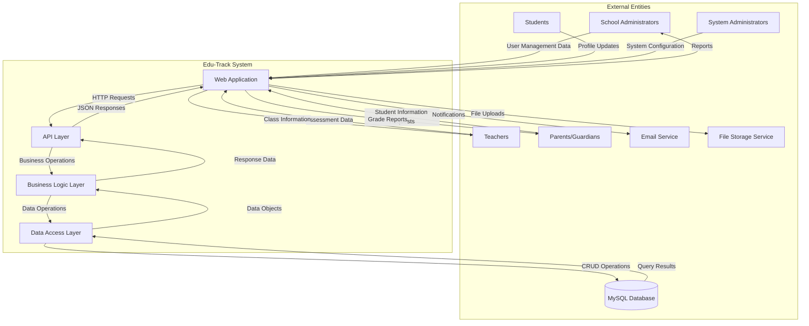

### 4.3.1 External Entity Descriptions

**School Administrators:**
- Primary users who manage school-wide operations
- Input: School configuration, user management, system settings
- Output: Administrative reports, system status

**Teachers:**
- Users who manage classes and assessments
- Input: Assessment data, grades, class information
- Output: Class reports, student performance data

**Parents/Guardians:**
- Users who access student information
- Input: Contact information updates
- Output: Student progress reports, notifications

**Students:**
- Users who view their academic information
- Input: Profile updates, preferences
- Output: Academic records, grades

**System Administrators:**
- Technical users who manage the platform
- Input: System configuration, maintenance tasks
- Output: System health reports, performance metrics

### 4.3.2 Data Flow Descriptions

**Authentication Flow:**
- Users provide credentials → System validates → Returns JWT token
- Token used for subsequent requests

**Student Management Flow:**
- Admin creates student record → System validates → Stores in database
- System generates notifications to relevant parties

**Assessment Flow:**
- Teacher creates assessment → System validates → Stores assessment data
- Teacher enters grades → System calculates statistics → Generates reports

## 4.4 Design Methods

### 4.4.1 Architectural Design

The architectural design follows a layered, multi-tenant approach with clear separation of concerns.

#### 4.4.1.1 High-Level Architecture

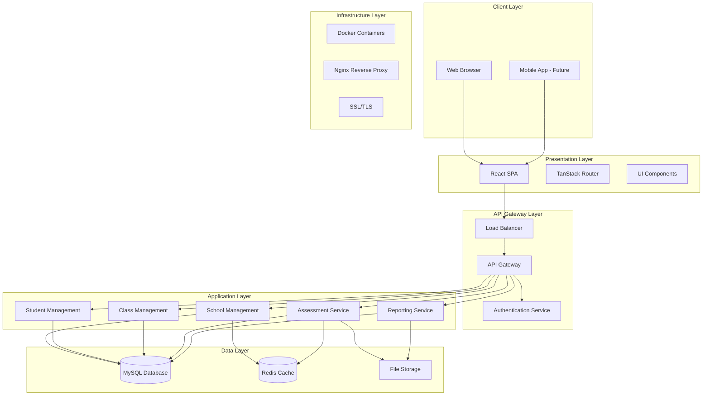

#### 4.4.1.2 Multi-Tenancy Architecture

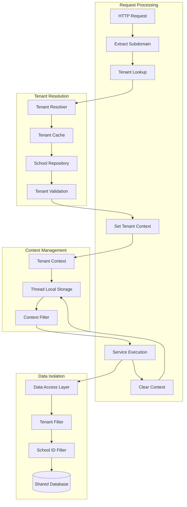

#### 4.4.1.3 Security Architecture

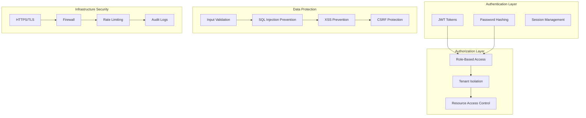

### 4.4.2 Detailed Design

#### 4.4.2.1 Object-Oriented Analysis and Design (OOAD) Approach

**Class Diagram - Core Entities**

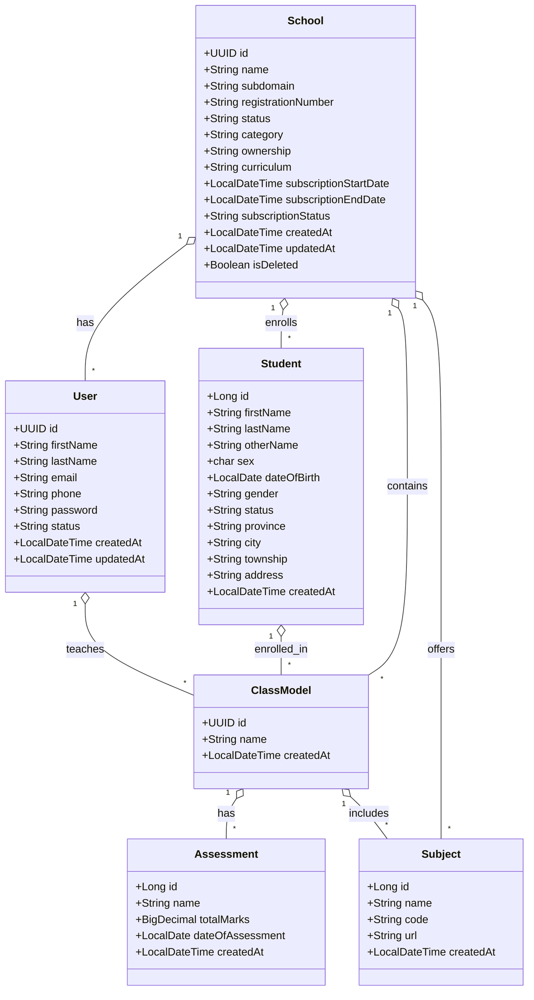

**Use Case Diagram**

```mermaid
graph TD
    Admin[School Administrator]
    Teacher[Teacher]
    Parent[Parent/Guardian]
    Student[Student]
    System[Edu-Track System]

    UC1[User Management]
    UC2[School Configuration]
    UC3[Report Generation]
    UC4[Class Management]
    UC5[Assessment Creation]
    UC6[Grade Entry]
    UC7[Performance View]
    UC8[Progress View]
    UC9[Contact Update]
    UC10[Notifications]
    UC11[Grade View]
    UC12[Profile Update]
    UC13[Authentication]
    UC14[Data Management]

    Admin -- Manages --> UC1
    Admin -- Configures --> UC2
    Admin -- Generates --> UC3
    Admin -- Manages --> UC4
    Teacher -- Creates --> UC5
    Teacher -- Enters --> UC6
    Teacher -- Views --> UC7
    Parent -- Views --> UC8
    Parent -- Updates --> UC9
    Parent -- Receives --> UC10
    Student -- Views --> UC11
    Student -- Updates --> UC12
    System -- Authenticates --> UC13
    System -- Manages --> UC14
```

**Sequence Diagram - Student Registration Process**

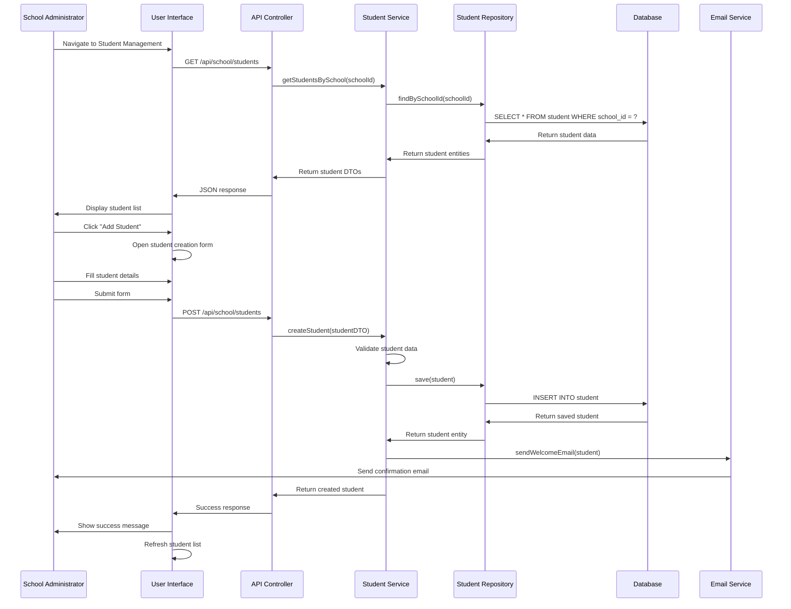

**State Chart Diagram - Student Status Management**

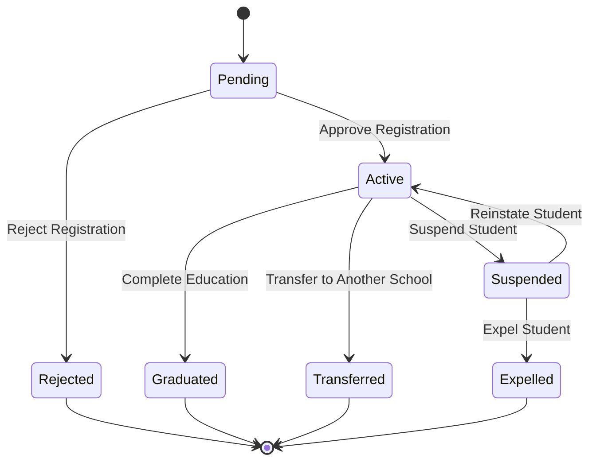

#### 4.4.2.2 Database Schema Design

**Entity-Relationship Diagram**

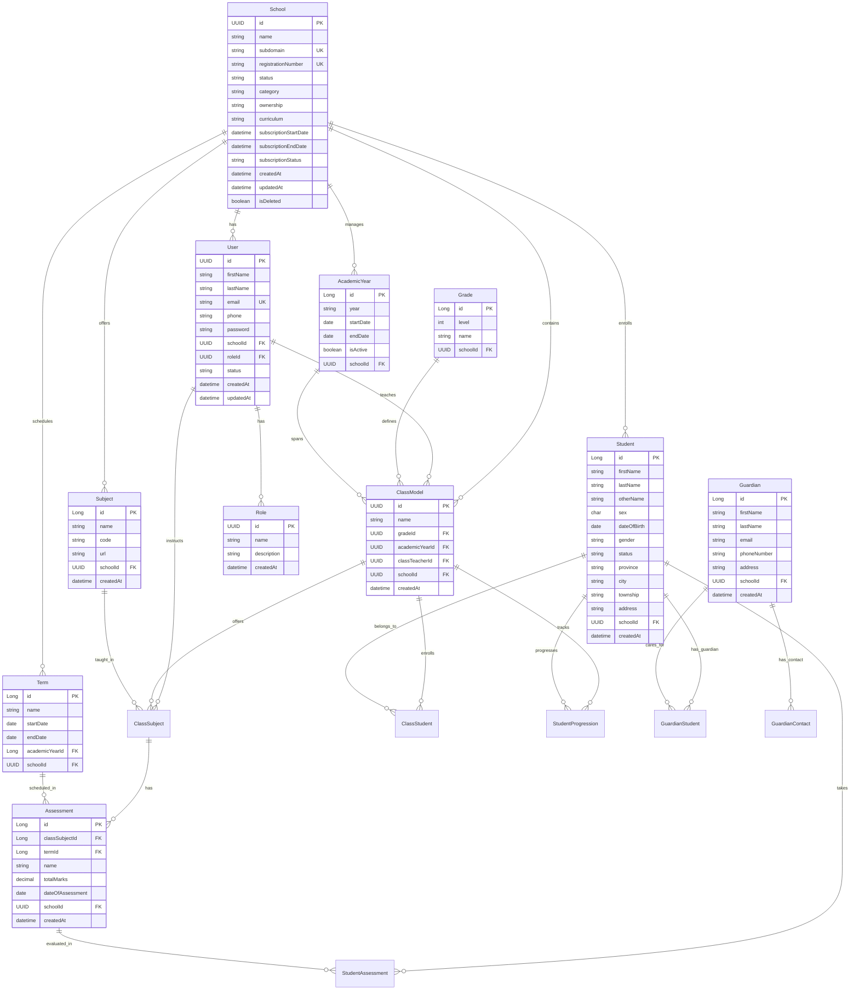

**Database Indexing Strategy**

```sql
-- Primary indexes (automatically created)
CREATE INDEX idx_school_subdomain ON school(subdomain);
CREATE INDEX idx_school_registration ON school(registration_number);
CREATE INDEX idx_user_email ON user(email);
CREATE INDEX idx_user_school ON user(school_id);
CREATE INDEX idx_student_school ON student(school_id);
CREATE INDEX idx_student_status ON student(status);
CREATE INDEX idx_class_school ON class(school_id);
CREATE INDEX idx_class_teacher ON class(class_teacher_id);
CREATE INDEX idx_assessment_class ON assessment(class_subject_id);
CREATE INDEX idx_assessment_term ON assessment(term_id);

-- Composite indexes for common queries
CREATE INDEX idx_student_school_status ON student(school_id, status);
CREATE INDEX idx_class_school_teacher ON class(school_id, class_teacher_id);
CREATE INDEX idx_assessment_class_term ON assessment(class_subject_id, term_id);
CREATE INDEX idx_student_assessment_student ON student_assessment(student_id, assessment_id);
CREATE INDEX idx_user_school_role ON user(school_id, role_id);

-- Full-text search indexes
CREATE FULLTEXT INDEX idx_student_name_search ON student(first_name, last_name, other_name);
CREATE FULLTEXT INDEX idx_school_name_search ON school(name);
```

#### 4.4.2.3 Algorithm Design

**1. Tenant Resolution Algorithm**

```pseudocode
ALGORITHM ResolveTenant
INPUT: hostname (string)
OUTPUT: tenantId (UUID) or null

BEGIN
    // Extract subdomain from hostname
    subdomain = ExtractSubdomain(hostname)
    
    // Check cache first
    IF cache.contains(subdomain) THEN
        RETURN cache.get(subdomain)
    END IF
    
    // Query database
    school = database.findSchoolBySubdomain(subdomain)
    
    IF school != null AND school.status = "approved" THEN
        // Add to cache
        cache.put(subdomain, school.id)
        RETURN school.id
    ELSE
        RETURN null
    END IF
END
```

**2. Student Grade Calculation Algorithm**

```pseudocode
ALGORITHM CalculateStudentGrade
INPUT: studentId (Long), classSubjectId (Long), termId (Long)
OUTPUT: grade (GradeResult)

BEGIN
    // Get all assessments for the student in this class subject and term
    assessments = database.getStudentAssessments(studentId, classSubjectId, termId)
    
    totalMarks = 0
    obtainedMarks = 0
    
    FOR EACH assessment IN assessments DO
        totalMarks = totalMarks + assessment.totalMarks
        obtainedMarks = obtainedMarks + assessment.marksObtained
    END FOR
    
    // Calculate percentage
    IF totalMarks > 0 THEN
        percentage = (obtainedMarks / totalMarks) * 100
    ELSE
        percentage = 0
    END IF
    
    // Determine grade based on percentage
    grade = DetermineGrade(percentage)
    
    RETURN GradeResult(percentage, grade, assessments)
END
```

**3. Multi-Tenant Data Filtering Algorithm**

```pseudocode
ALGORITHM FilterByTenant
INPUT: query (Query), tenantId (UUID)
OUTPUT: filteredQuery (Query)

BEGIN
    // Add tenant filter to all queries
    filteredQuery = query.addFilter("school_id", tenantId)
    
    // Add soft delete filter
    filteredQuery = filteredQuery.addFilter("is_deleted", false)
    
    RETURN filteredQuery
END
```

### 4.4.3 Physical Design

#### 4.4.3.1 User Interface Design

**Dashboard Layout Structure**

```mermaid
graph TB
    subgraph "Main Layout"
        Header[Header Component]
        Sidebar[Sidebar Navigation]
        MainContent[Main Content Area]
        Footer[Footer Component]
    end
    
    subgraph "Header Elements"
        Logo[School Logo]
        UserMenu[User Menu]
        Notifications[Notification Bell]
        SearchBar[Global Search]
    end
    
    subgraph "Sidebar Navigation"
        Dashboard[Dashboard]
        Students[Student Management]
        Classes[Class Management]
        Assessments[Assessments]
        Reports[Reports]
        Settings[Settings]
    end
    
    subgraph "Main Content"
        Breadcrumb[Breadcrumb Navigation]
        PageTitle[Page Title]
        ContentArea[Content Area]
        Pagination[Pagination]
    end
    
    Header --> Logo
    Header --> UserMenu
    Header --> Notifications
    Header --> SearchBar
    
    Sidebar --> Dashboard
    Sidebar --> Students
    Sidebar --> Classes
    Sidebar --> Assessments
    Sidebar --> Reports
    Sidebar --> Settings
    
    MainContent --> Breadcrumb
    MainContent --> PageTitle
    MainContent --> ContentArea
    MainContent --> Pagination
```

**Student Management Interface Flow**

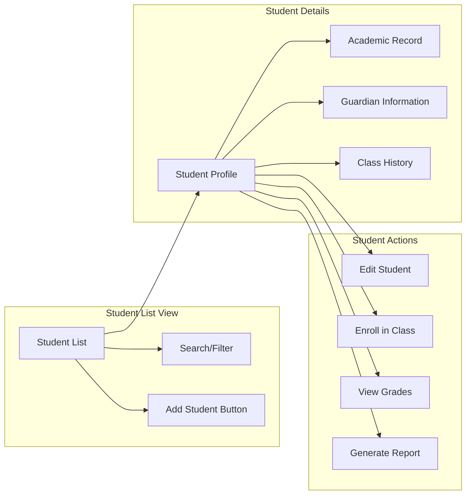

#### 4.4.3.2 Data Input/Output Design

**Data Input Validation Process**

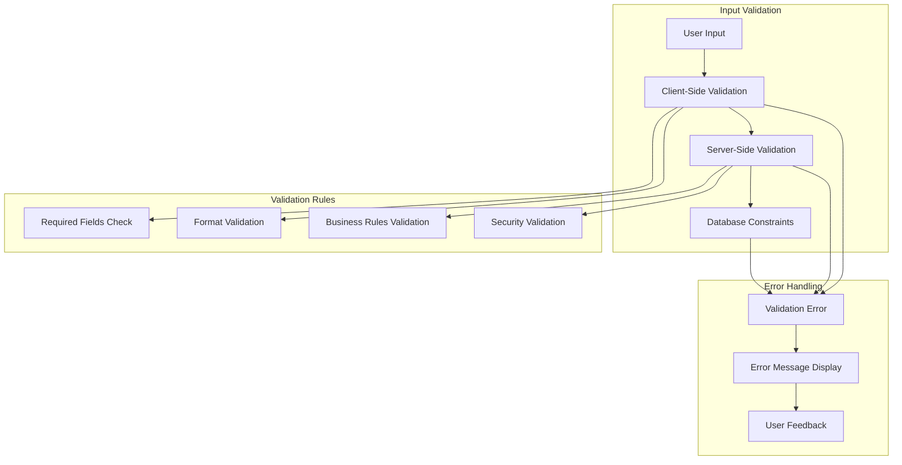

**Data Output Format Design**

```json
{
  "success": true,
  "data": {
    "students": [
      {
        "id": 1,
        "firstName": "John",
        "lastName": "Doe",
        "email": "john.doe@school.com",
        "status": "active",
        "currentClass": {
          "id": "uuid-123",
          "name": "Grade 10A",
          "teacher": {
            "id": "uuid-456",
            "name": "Jane Smith"
          }
        },
        "recentAssessments": [
          {
            "id": 1,
            "name": "Mathematics Mid-Term",
            "score": 85,
            "totalMarks": 100,
            "date": "2024-01-15"
          }
        ]
      }
    ],
    "pagination": {
      "page": 0,
      "size": 20,
      "totalElements": 150,
      "totalPages": 8
    }
  },
  "message": "Students retrieved successfully",
  "timestamp": "2024-01-20T10:30:00Z"
}
```

#### 4.4.3.3 Process Design

**Student Registration Process**

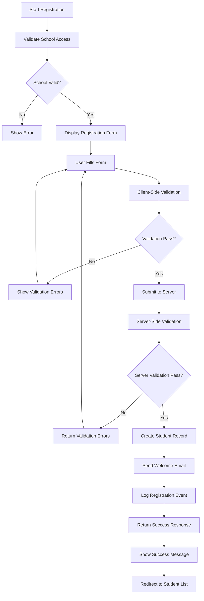

**Assessment Grading Process**

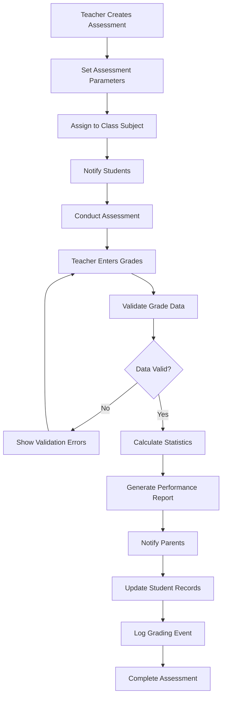

## 4.5 System Maintenance Recommendations

### 4.5.1 Database Maintenance

**Regular Maintenance Tasks:**
1. **Daily Backups**: Automated database backups with point-in-time recovery
2. **Index Optimization**: Weekly analysis and optimization of database indexes
3. **Data Archiving**: Monthly archiving of old academic records
4. **Performance Monitoring**: Continuous monitoring of query performance
5. **Storage Management**: Regular cleanup of temporary files and logs

**Maintenance Scripts:**
```sql
-- Index optimization script
ANALYZE TABLE student, class, assessment, user;

-- Data archiving script
INSERT INTO archived_students 
SELECT * FROM student 
WHERE created_at < DATE_SUB(NOW(), INTERVAL 5 YEAR);

-- Cleanup script
DELETE FROM temporary_files WHERE created_at < DATE_SUB(NOW(), INTERVAL 7 DAY);
```

### 4.5.2 Application Maintenance

**Regular Maintenance Tasks:**
1. **Log Rotation**: Daily rotation of application logs
2. **Cache Clearing**: Weekly clearing of expired cache entries
3. **Security Updates**: Monthly security patch updates
4. **Performance Monitoring**: Continuous monitoring of application performance
5. **Backup Verification**: Weekly verification of backup integrity

**Maintenance Procedures:**
```bash
#!/bin/bash
# Daily maintenance script

# Rotate logs
logrotate /etc/logrotate.d/edutrack

# Clear expired cache
redis-cli --eval clear_expired_cache.lua

# Check disk space
df -h | grep -E "(80%|90%|100%)" && echo "Disk space warning"

# Verify backups
./verify_backup.sh

# Send maintenance report
./send_maintenance_report.sh
```

### 4.5.3 Security Maintenance

**Regular Security Tasks:**
1. **Vulnerability Scanning**: Weekly automated security scans
2. **Access Review**: Monthly review of user access permissions
3. **Security Updates**: Immediate application of security patches
4. **Audit Log Review**: Weekly review of security audit logs
5. **Penetration Testing**: Quarterly penetration testing

**Security Monitoring:**
```java
@Component
public class SecurityMonitor {
    
    @Scheduled(fixedRate = 300000) // Every 5 minutes
    public void monitorFailedLogins() {
        List<LoginAttempt> failedAttempts = loginAttemptRepository
            .findRecentFailedAttempts(Duration.ofMinutes(5));
        
        if (failedAttempts.size() > 10) {
            securityAlertService.sendAlert("Multiple failed login attempts detected");
        }
    }
    
    @Scheduled(cron = "0 0 2 * * ?") // Daily at 2 AM
    public void reviewUserAccess() {
        List<User> inactiveUsers = userRepository.findInactiveUsers(Duration.ofDays(90));
        for (User user : inactiveUsers) {
            userService.deactivateUser(user.getId());
        }
    }
}
```

### 4.5.4 Performance Maintenance

**Performance Monitoring:**
1. **Response Time Monitoring**: Track API response times
2. **Database Performance**: Monitor slow queries and optimize
3. **Memory Usage**: Monitor application memory consumption
4. **CPU Usage**: Track server CPU utilization
5. **Network Performance**: Monitor network latency and throughput

**Performance Optimization:**
```java
@Component
public class PerformanceMonitor {
    
    @EventListener
    public void handleSlowQuery(SlowQueryEvent event) {
        log.warn("Slow query detected: {}", event.getQuery());
        performanceAlertService.sendAlert("Slow query detected", event);
    }
    
    @Scheduled(fixedRate = 60000) // Every minute
    public void checkSystemHealth() {
        SystemHealth health = systemHealthService.getCurrentHealth();
        
        if (health.getCpuUsage() > 80) {
            performanceAlertService.sendAlert("High CPU usage detected");
        }
        
        if (health.getMemoryUsage() > 85) {
            performanceAlertService.sendAlert("High memory usage detected");
        }
    }
}
```

## 4.6 Conclusion

This chapter has presented a comprehensive system design for the Edu-Track Educational Management System, following established software engineering principles and best practices. The design process involved careful analysis of requirements, evaluation of alternative solutions, and systematic decision-making based on functional and non-functional requirements.

### Key Design Achievements:

1. **Multi-Tenant Architecture**: Successfully designed a scalable multi-tenant system with proper data isolation and security measures.

2. **Layered Architecture**: Implemented a clean separation of concerns with distinct presentation, business logic, and data access layers.

3. **Security-First Approach**: Incorporated comprehensive security measures including authentication, authorization, and data protection.

4. **Scalable Design**: Created an architecture that supports horizontal scaling and can accommodate future growth.

5. **Maintainable Codebase**: Established clear design patterns and modular structure for easy maintenance and future enhancements.

### Design Decisions Justified:

- **Technology Stack**: Spring Boot and React were chosen for their enterprise-grade features, strong ecosystem, and team expertise.
- **Multi-Tenancy Model**: Shared database with tenant isolation was selected for optimal balance of security, cost, and maintenance.
- **Database Design**: MySQL was chosen for its reliability, ACID compliance, and strong community support.
- **Frontend Architecture**: React with TypeScript provides type safety, component reusability, and excellent developer experience.

### Future Considerations:

The design includes provisions for future enhancements such as:
- Microservices architecture migration
- Real-time communication features
- Advanced analytics and reporting
- Mobile application development
- Integration with external educational systems

The system design provides a solid foundation for implementing a robust, scalable, and maintainable educational management platform that meets current requirements while accommodating future growth and feature additions. 
