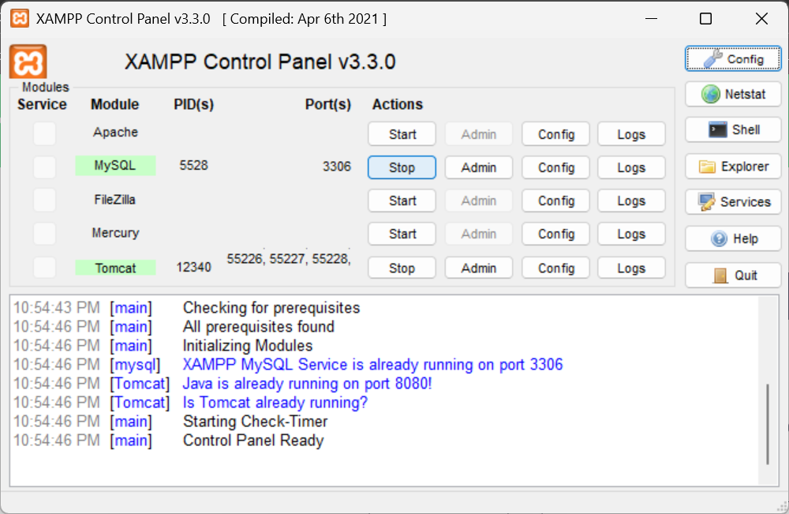
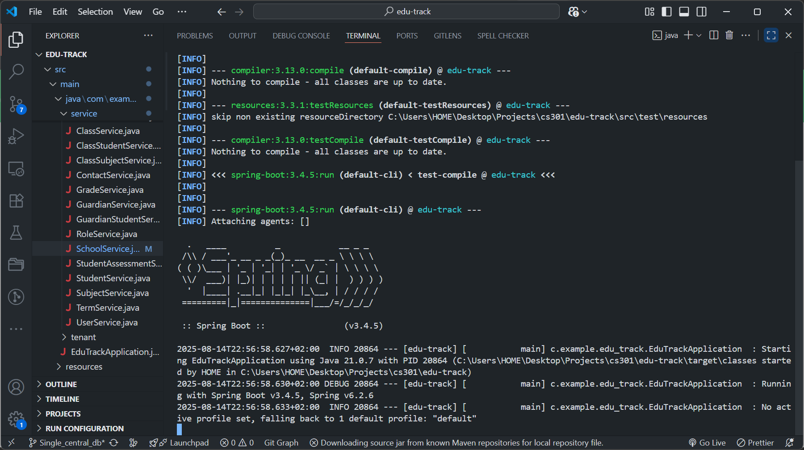
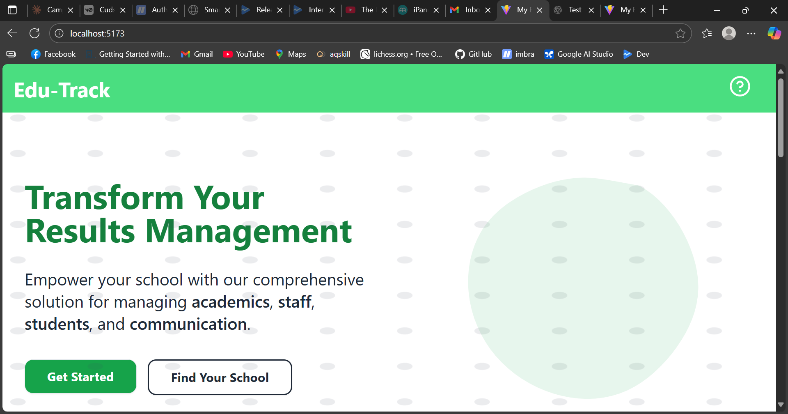

# Edu-Track Installation Guide (Developer)

This guide explains how to set up the full development environment for the Edu-Track app:
- Backend REST API (Spring Boot)
- Frontend (React + Vite + TypeScript)
- MySQL database via XAMPP

It is tailored to this repository structure:
- Backend: `edu-track/` (Spring Boot, Maven)
- Frontend: `results-amangement-system/` (Vite + React)
- Docs: `results-amangement-system/documentation/`

Refer to the existing architecture diagrams for context:
- `results-amangement-system/documentation/system_architecture.svg`
- `results-amangement-system/documentation/workflow.svg`

---

## Prerequisites

- Java 17 (required by Spring Boot)
- Maven 3.9+
- XAMPP (MySQL) or standalone MySQL 8.x
- Bun (recommended) or Node 18+ (Bun is used in scripts)
  - Install Bun: https://bun.sh
- Git

Verify versions:
```bash
java -version
mvn -v
bun -v   # or node -v && npm -v
```

---

## 1) Database Setup (XAMPP MySQL)

1. Start XAMPP Control Panel.
2. Start the MySQL service.
3. Open phpMyAdmin (http://localhost/phpmyadmin) or use MySQL CLI.
4. Create the database:
   ```sql
   CREATE DATABASE edu_track CHARACTER SET utf8mb4 COLLATE utf8mb4_unicode_ci;
   ```
5. Credentials used by the backend are configured in `edu-track/src/main/resources/application.properties`:
   ```properties
   spring.datasource.jdbc-url=jdbc:mysql://localhost:3306/edu_track
   spring.datasource.username=root
   spring.datasource.password=
   ```
   - If your MySQL root has a password, set `spring.datasource.password=<your_password>`.
   - If you prefer a non-root user, create one and grant rights:
     ```sql
     CREATE USER 'edutrack'@'%' IDENTIFIED BY 'strong_password';
     GRANT ALL PRIVILEGES ON edu_track.* TO 'edutrack'@'%';
     FLUSH PRIVILEGES;
     ```
     Then update `username` and `password` accordingly.

6. Schema/migrations:
   - The project currently has `spring.jpa.hibernate.ddl-auto=none` (no auto schema creation).
   - For local development you have two options:
     - Option A (recommended for dev): temporarily set `ddl-auto=update` to let Hibernate create/update tables automatically.
       ```properties
       # change this locally during development only
       spring.jpa.hibernate.ddl-auto=update
       ```
       Remember to revert to `none` before committing to production.
     - Option B: use provided SQL once available (not present in repo now). If you have an export, import it into `edu_track`.

---

## 2) Backend API Setup (Spring Boot)

Project: `edu-track/`

Key configuration:
- Port: `server.port=8080` (see `application.properties`)
- DB: MySQL at `localhost:3306`, DB `edu_track`
- JWT: configured via `app.jwt.*` properties

Run the API:
```bash
# from repo root or any directory, run Maven in the backend folder
mvn -f edu-track\pom.xml spring-boot:run
```

Alternative (package and run):
```bash
mvn -f edu-track\pom.xml clean package
java -jar edu-track\target\edu-track-0.0.1-SNAPSHOT.jar
```

Verify:
- API should start at http://127.0.0.1:8080
- Watch logs for successful DB connection

Common issues:
- Access denied to DB: verify `username/password` and that DB `edu_track` exists.
- Port 8080 in use: either stop the other service or change `server.port` in `application.properties`.

---

## 3) Frontend Setup (Vite + React)

Project: `results-amangement-system/`

Install dependencies (Bun):
```bash
bun install --cwd "results-amangement-system"
```

Start dev server:
```bash
bun run --cwd "results-amangement-system" dev
```

Vite dev server runs at: http://127.0.0.1:5173 (default)

API proxy:
- `results-amangement-system/vite.config.ts` proxies `/api` to the backend:
  ```ts
  server: {
    proxy: {
      "/api": {
        target: 'http://127.0.0.1:8080',
        changeOrigin: true,
      }
    }
  }
  ```
- Keep the backend running on port `8080` for the proxy to work.

Build for production (optional):
```bash
bun run --cwd "results-amangement-system" build
bun run --cwd "results-amangement-system" preview
```

---

## 4) First Run: Creating a School and Users

Frontend routes use a `/api` prefix (proxied). Typical flow:
1. Open the app at `http://127.0.0.1:5173`
2. Register a school (see User Manual; route: `src/routes/register-school.tsx`).
3. Access system admin tools at `/system-admin` (see `src/routes/system-admin/index.tsx`) to review or manage schools.
4. For a given school subdomain, visit `http://127.0.0.1:5173/<subdomain>` to access the school's landing page (see `src/routes/$school/index.tsx`).
5. School admins/teachers/guardians use the auth routes under `/$school/auth/`.

---

## 5) Suggested Local Development Settings

- Keep `spring.jpa.hibernate.ddl-auto=update` during iterative development to avoid manual schema changes.
- Create some seed data using the UI and then export the DB via phpMyAdmin for teammates.
- Consider adding Flyway or Liquibase later for versioned migrations.

---

## 6) Troubleshooting

- 404s to `/api/...` from the frontend:
  - Ensure backend is running and reachable at `http://127.0.0.1:8080`.
  - Ensure Vite dev server started without errors and proxy section exists in `vite.config.ts`.
- CORS errors when not using Vite dev server:
  - Use the Vite proxy during development or configure CORS in Spring Boot.
- Blank page or React errors:
  - Run `bun install` again, clear cache, check browser console.
- MySQL service not starting in XAMPP:
  - Ensure no conflicting MySQL service is running. Try changing the MySQL port in XAMPP and update JDBC URL accordingly.

---

## 7) Optional: Directory Quick Reference

- Backend
  - `edu-track/pom.xml` – Spring Boot 3.4.5, JPA, Web, Validation, MySQL
  - `edu-track/src/main/resources/application.properties` – DB, JWT, port
- Frontend
  - `results-amangement-system/package.json` – scripts (Bun + Vite)
  - `results-amangement-system/vite.config.ts` – `/api` proxy to `8080`
  - `results-amangement-system/src/routes/` – app routes (admin/teacher/guardian flows)

---

## 8) Visuals and Screenshots

Place UI screenshots under `results-amangement-system/public/manual-images/` and reference them in docs.
Examples (add these images after you capture them):
- 
- 
- 
- 

Tip: Use descriptive filenames and keep arrows/annotations in images for clarity.
