# Comprehensive Process Design Diagram

Below is a process flow diagram representing the main functionalities and user flows of the application:

```mermaid
flowchart TD
    A["User Login/Register"] --> B["Dashboard"]
    B --> C1["Student Management"]
    B --> C2["Class Management"]
    B --> C3["Subject Management"]
    B --> C4["Assessment Management"]
    B --> C5["Reports & Analytics"]
    B --> C6["School Profile & Calendar"]
    B --> C7["Staff Management"]
    B --> C8["Settings & Communication"]

    %% Student Management
    C1 --> D1["View Students"]
    C1 --> D2["Add/Edit/Delete Student"]
    C1 --> D3["Student Details"]
    D3 --> D4["Student Performance"]
    D3 --> D5["Student Assessments"]

    %% Class Management
    C2 --> E1["View Classes"]
    C2 --> E2["Add/Edit/Delete Class"]
    C2 --> E3["Assign Students to Class"]
    C2 --> E4["Assign Subjects to Class"]
    E1 --> E5["Class Performance"]
    E1 --> E6["Class Assessments"]

    %% Subject Management
    C3 --> F1["View Subjects"]
    C3 --> F2["Add/Edit/Delete Subject"]
    C3 --> F3["Assign Teachers"]

    %% Assessment Management
    C4 --> G1["Create/Edit/Delete Assessment"]
    C4 --> G2["Enter Results"]
    C4 --> G3["View Assessment Stats"]

    %% Reports & Analytics
    C5 --> H1["Generate Reports"]
    C5 --> H2["View Analytics"]
    C5 --> H3["Export Data"]

    %% School Profile & Calendar
    C6 --> I1["Edit School Profile"]
    C6 --> I2["Manage Calendar"]

    %% Staff Management
    C7 --> J1["View Staff"]
    C7 --> J2["Add/Edit/Delete Staff"]
    C7 --> J3["Assign Roles"]

    %% Settings & Communication
    C8 --> K1["User Settings"]
    C8 --> K2["Reset Password"]
    C8 --> K3["Send Communication"]
    C8 --> K4["Help Desk"]

    %% Auth Flows
    A --> L1["Forgot Password"]
    A --> L2["Register New School"]
    L2 --> B
    L1 --> B
```

This diagram covers the end-to-end process and all major modules of the application, from authentication to management, reporting, and communication. 