# Edu-Track User Manual

This manual explains how end-users interact with the Edu-Track application:
- System Admins (manage schools on the platform)
- School Admins (configure a specific school)
- Teachers (manage classes and assessments)
- Guardians (view and interact with their ward’s records)

It references the app’s routes found under `results-amangement-system/src/routes/` and aligns with the current UI.

Images are referenced as placeholders in `results-amangement-system/public/manual-images/`. Replace them with actual screenshots as you capture them.

---

## 1) Getting Started

- App URL during development: `http://127.0.0.1:5173`
- API is proxied from the frontend to the backend at `http://127.0.0.1:8080` via Vite (see `vite.config.ts`).

Navigation overview:
- Home/Landing: `/`
- Register a School: `/register-school` (see `src/routes/register-school.tsx`)
- System Admin console: `/system-admin` (see `src/routes/system-admin/index.tsx`)
- School context: `/<school-subdomain>` (see `src/routes/$school/index.tsx`)
- School dashboard (role-based areas): `/<school-subdomain>/dashboard/...`
- Auth: `/<school-subdomain>/auth/...` (login/register flows)

---

## 2) Registering a School (First-time Setup)

Any user can request to register a new school on the platform.

Steps:
1. Visit `http://127.0.0.1:5173/register-school`.
2. Fill in the school details form (name, subdomain, contact info, etc.).
3. Submit the form.
4. The school record appears in the System Admin console for review.

Visuals to capture:
- 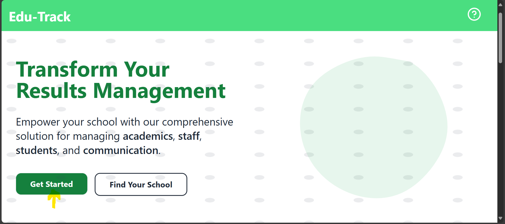
- 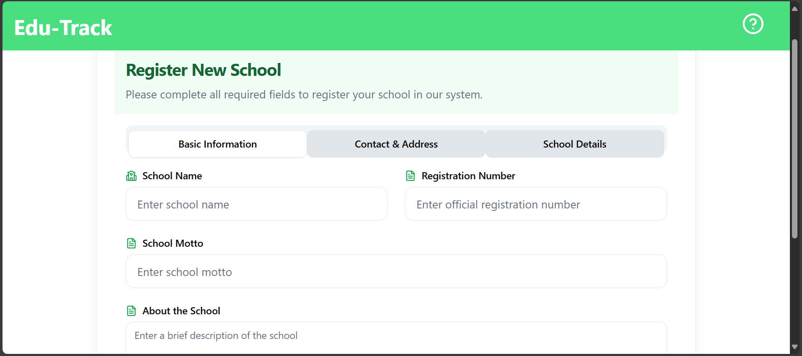
- 

Relevant code: `src/routes/register-school.tsx` (uses `POST /api/schools/`).

---

## 3) System Admin Use Cases

System Admins oversee all schools on the platform.

Access:
- Go to `/system-admin`.

Key actions (see `src/routes/system-admin/index.tsx`):
- View list of schools (`GET /api/schools/`).
- Open a school details panel (`GET /api/schools/{id}`).
- Search a system admin by email (`GET /api/system-admins/email/{email}`).
- Perform actions such as approving or updating a school.

Typical workflow:
1. Open `/system-admin` and load schools.
2. Review new school registrations.
3. Approve/activate the school.
4. Communicate credentials or onboarding steps to the School Admin.

Visuals to capture:
- 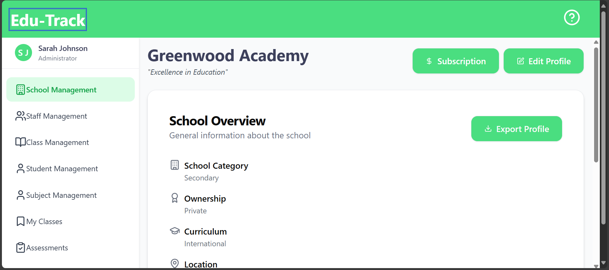
- 

---

## 4) School Admin Use Cases

A School Admin configures and manages a specific school’s data. Enter the school via its subdomain path:
- `http://127.0.0.1:5173/<subdomain>`
- Dashboard routes: `/<subdomain>/dashboard/...`

Common areas and actions:

- School Profile (see `src/routes/$school/dashboard/school/index.tsx`)
  - View or update school details (`/api/schools/{id}` and `/api/schools/{subdomain}/subdomain`).
  - Visuals:
    - 

- Staff Management (see `src/routes/$school/dashboard/staff-management/`)
  - View users/staff: `GET /api/{school}/users/`
  - Assign roles: `GET /api/{school}/roles/` and `PUT /api/users/{userId}/role`
  - Update personal details/password: `PUT /api/users/{userId}/personal-details`, `PUT /api/users/{userId}/password`
  - Visuals:
    - 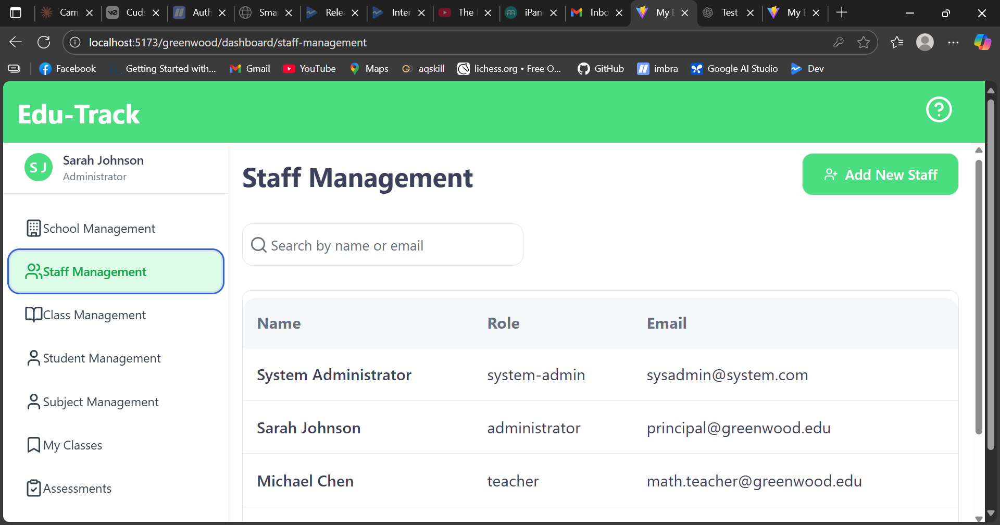
    - 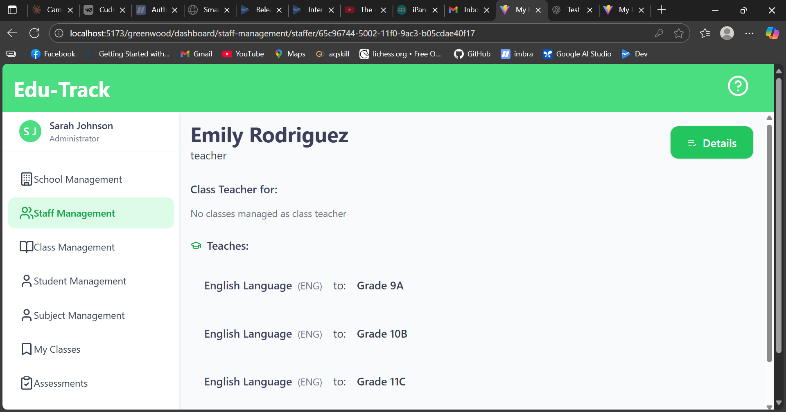

- Subject Management (see `src/routes/$school/dashboard/subject-management/index.tsx`)
  - List subjects: `GET /api/{school}/subjects/`
  - Create/update subjects: `POST/PUT /api/{school}/subjects/`
  - Visuals:
    - 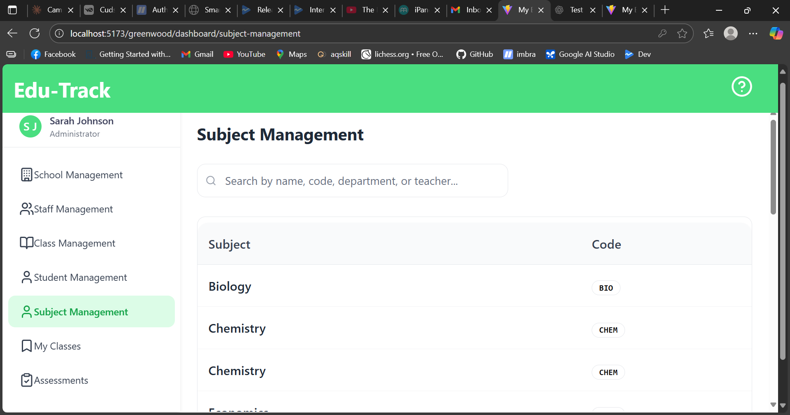

- Class Management (see `src/routes/$school/dashboard/class-management/`)
  - List/Create classes: `GET/POST /api/{school}/classes/`
  - Assign teachers/subjects: combined calls to `/api/{school}/users/` and `/api/{school}/subjects/`
  - Academic years and grades: `GET /api/{school}/academic-years/`, `GET /api/{school}/grades/`
  - Visuals:
    - 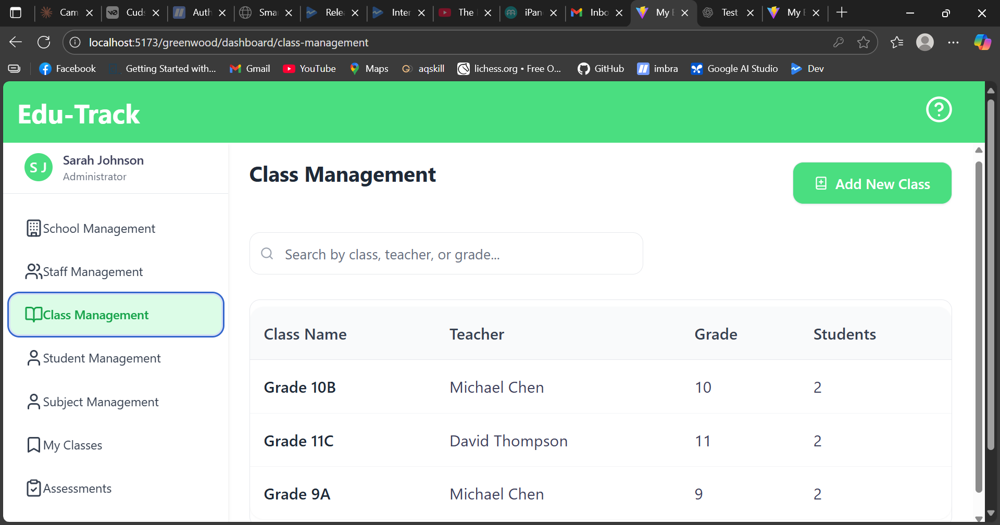
    - 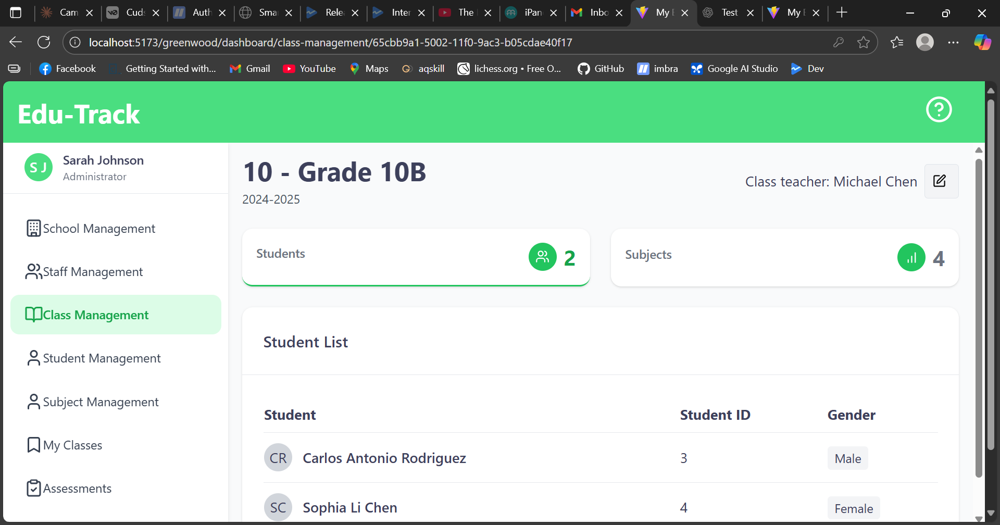

- Student Management (see `src/routes/$school/dashboard/student-management/`)
  - List students: `GET /api/{school}/students/`
  - View a student: `GET /api/{school}/students/{id}`
  - Create/update student profiles
  - Visuals:
    - 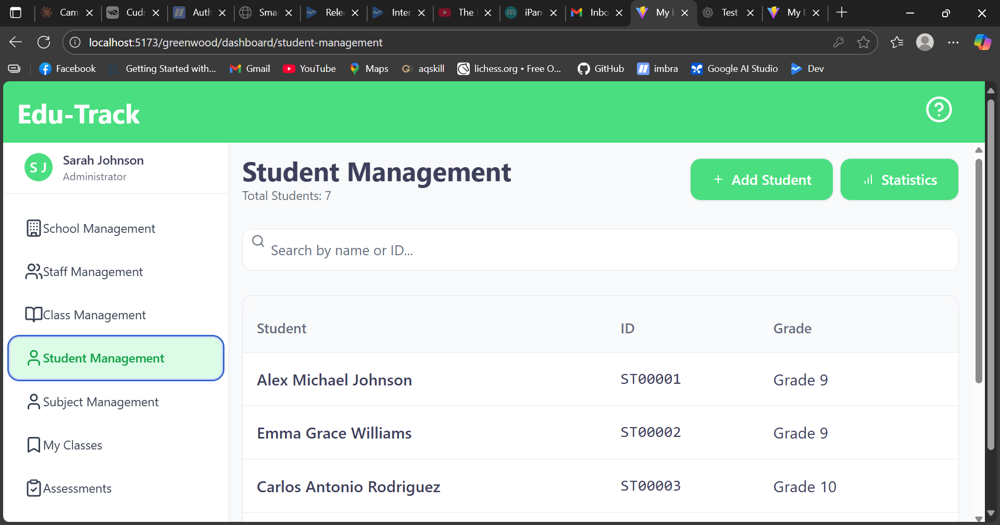
    - 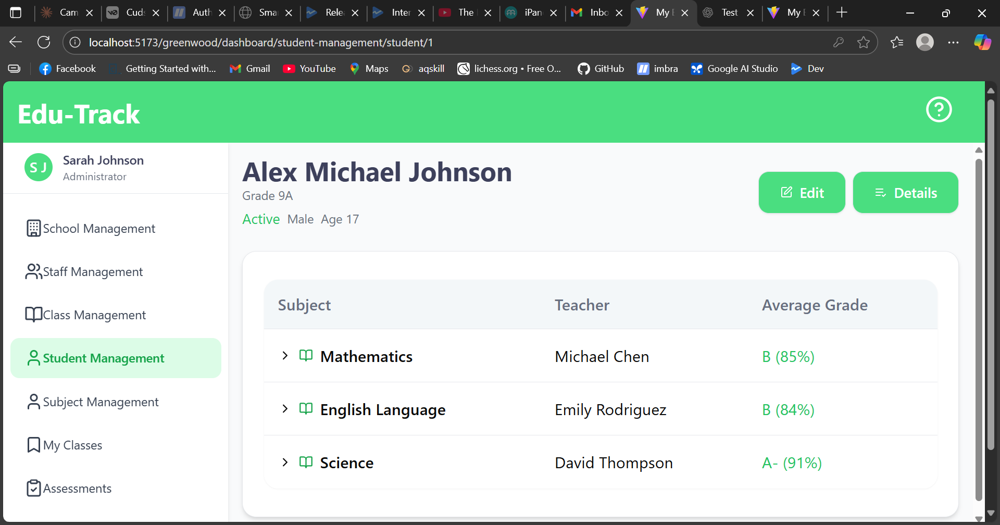

- Assessments (see `src/routes/$school/dashboard/assessments/index.tsx`)
  - View/filter assessments for classes and subjects.
  - Create/record assessment entries for students.
  - Visuals:
    - 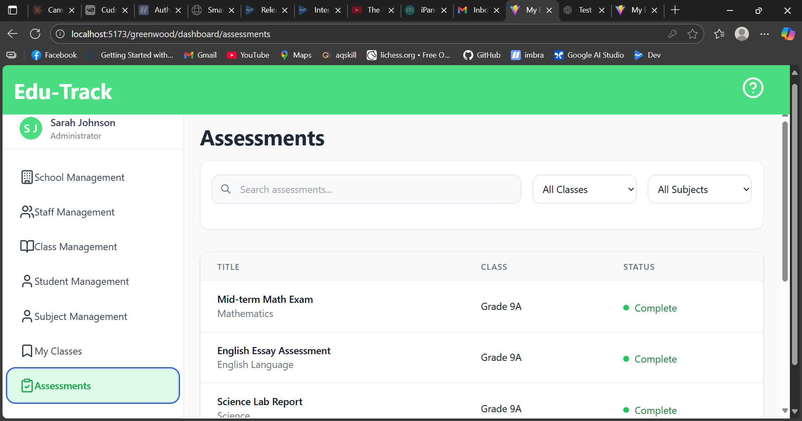

Tips:
- Use the Refresh/Retry controls in lists when changes don’t immediately appear.
- Ensure the backend is running for all `/api/...` actions to work.

---

## 5) Teacher Use Cases

Teachers primarily manage their classes and assessments.

Access:
- Visit `/<subdomain>/dashboard/classes/` to see assigned classes (see `src/routes/$school/dashboard/classes/index.tsx`).

Common actions:
- View class details: `/<subdomain>/dashboard/classes/<classId>` (`src/routes/$school/dashboard/classes/$id/index.tsx`)
- View students in a class.
- Enter/Update assessments for students (see the Assessments screens under the dashboard).

Steps example (recording an assessment):
1. Open your class page.
2. Select subject/assessment type.
3. Enter scores for students.
4. Save/submit. The data is stored via `/api/{school}/...` endpoints.

Visuals:
- 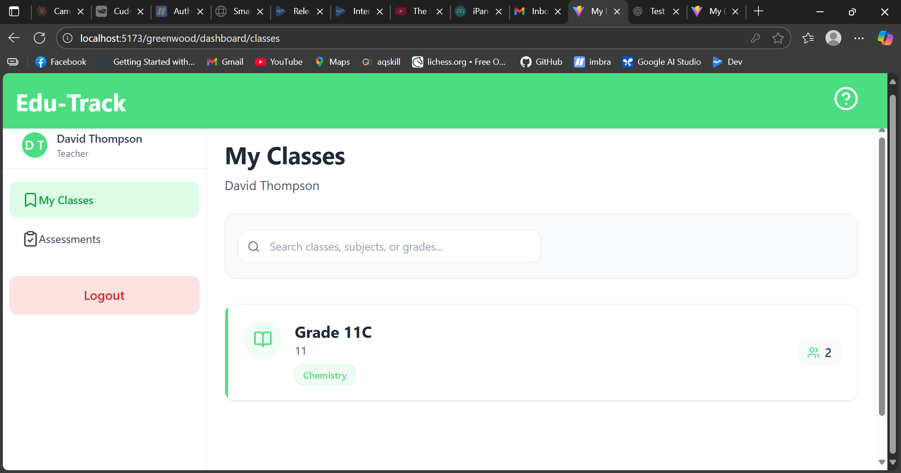
- 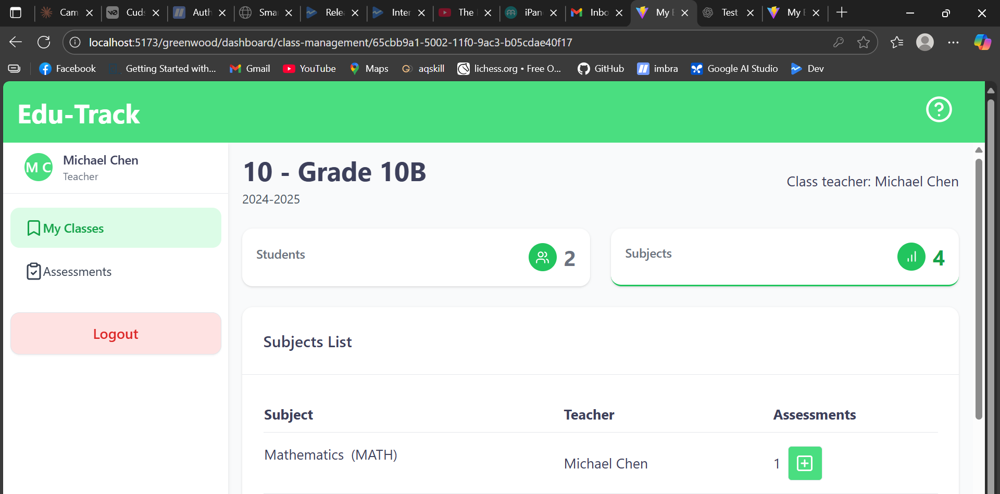
- 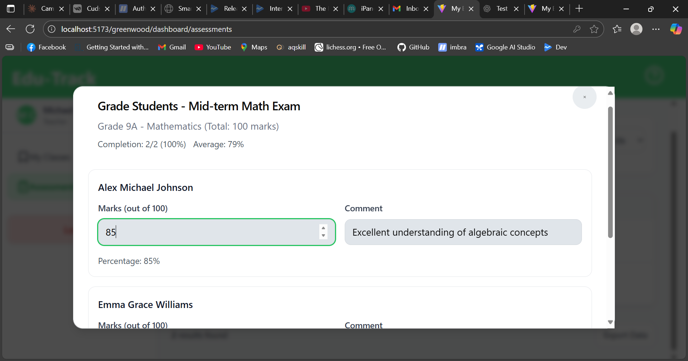

---

## 6) Guardian Use Cases

Guardians register and view their ward’s information and results.

Registration/Login:
- Go to `/<subdomain>/auth/register` (see `src/routes/$school/auth/register.tsx`).
  - Registration may require a student identifier and guardian email.
- Login at `/<subdomain>/auth/login` (see `src/routes/$school/auth/login.tsx`).

Common actions:
- View student profile and class placement (see `src/components/student-page.tsx` and student-related routes).
- View assessments or term results pages if provided by the school configuration.

Steps example (viewing a student):
1. Log in to your school portal: `/<subdomain>/auth/login`.
2. Navigate to your dashboard/home.
3. Open your child’s profile to view details and results.

Visuals:
- 
- 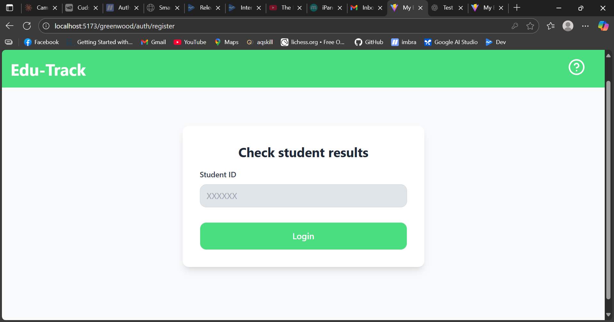
- 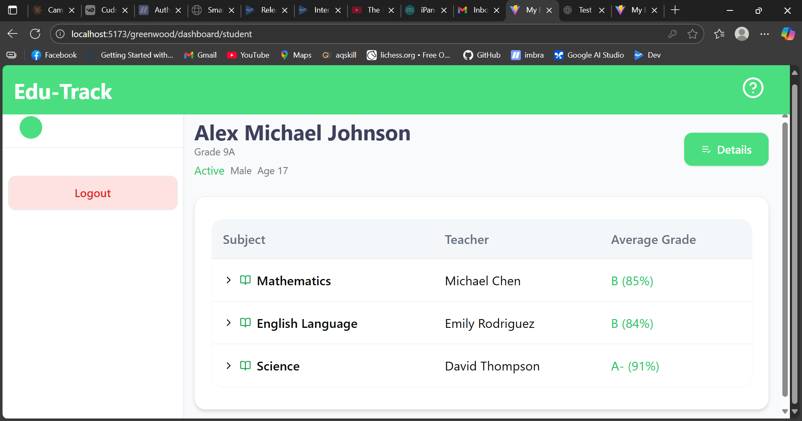

---

## 7) Authentication and Roles

- Authentication is handled via backend JWT (`app.jwt.*` in `application.properties`).
- Users are assigned roles (e.g., Admin, Teacher, Guardian) that control access to dashboard sections.
- If you cannot access a section, contact your School Admin to check your role assignments.

---

## 8) URLs Cheat Sheet

- Platform Home: `/`
- Register School: `/register-school`
- System Admin: `/system-admin`
- School Landing: `/<subdomain>`
- School Dashboard root: `/<subdomain>/dashboard`
- Classes: `/<subdomain>/dashboard/classes`
- Subjects: `/<subdomain>/dashboard/subject-management`
- Students: `/<subdomain>/dashboard/student-management`
- Staff: `/<subdomain>/dashboard/staff-management`
- Assessments: `/<subdomain>/dashboard/assessments`
- Auth Register: `/<subdomain>/auth/register`
- Auth Login: `/<subdomain>/auth/login`

Note: Exact labels may vary slightly in the UI.

---

## 9) Troubleshooting & Tips

- If lists are empty:
  - Click Retry/Refresh in the UI.
  - Ensure the backend API is running and database is connected.
- If you see an error banner:
  - Use any provided “Retry” button.
  - Capture a screenshot and contact your School Admin or System Admin.
- If your subdomain path (e.g., `/my-school`) doesn’t load:
  - Confirm the school was registered and approved.
  - Verify the correct subdomain spelling.

---

## 10) Visuals and How to Update This Manual

- Store screenshots in `results-amangement-system/public/manual-images/`.
- Use clear names and add annotations (arrows/boxes) for clarity.
- After placing images, ensure the relative links in this manual render correctly.

Example placeholders to replace:
- 
- 
- 

---

## 11) Feedback

If something in this manual doesn’t match the UI or you need additional steps, please report it to the development team so we can update the documentation.
