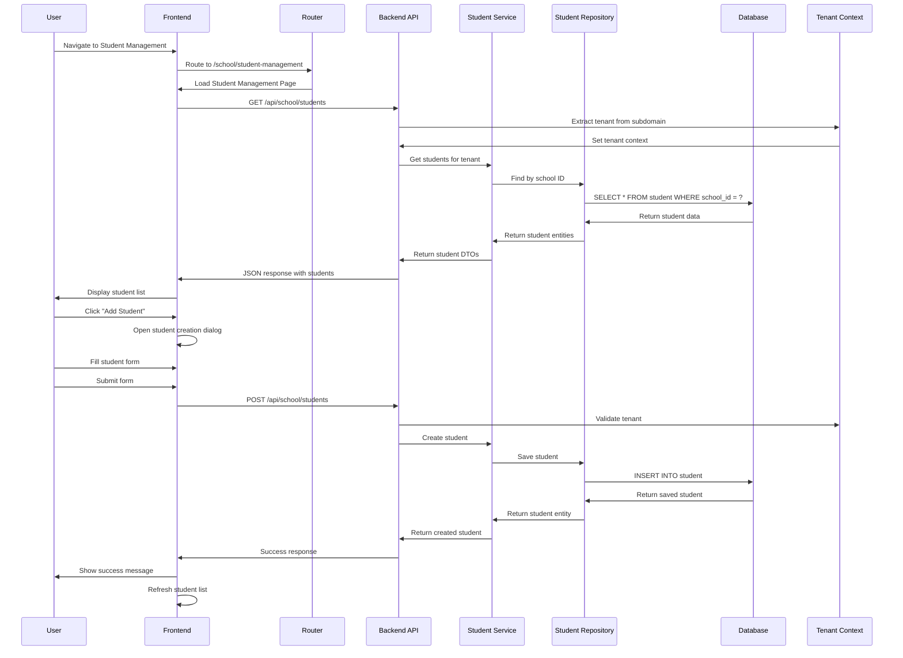
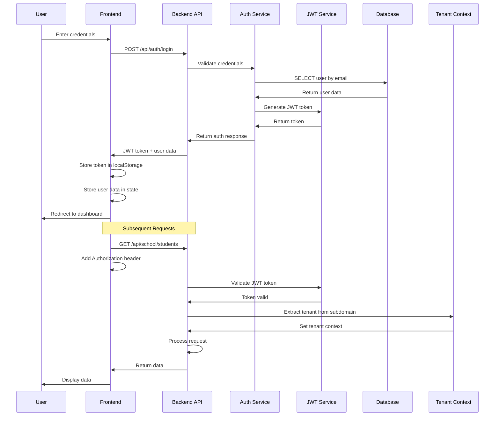
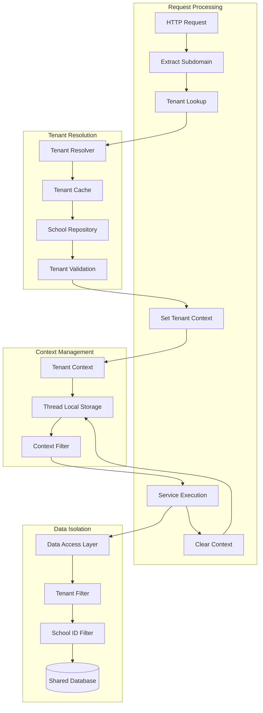
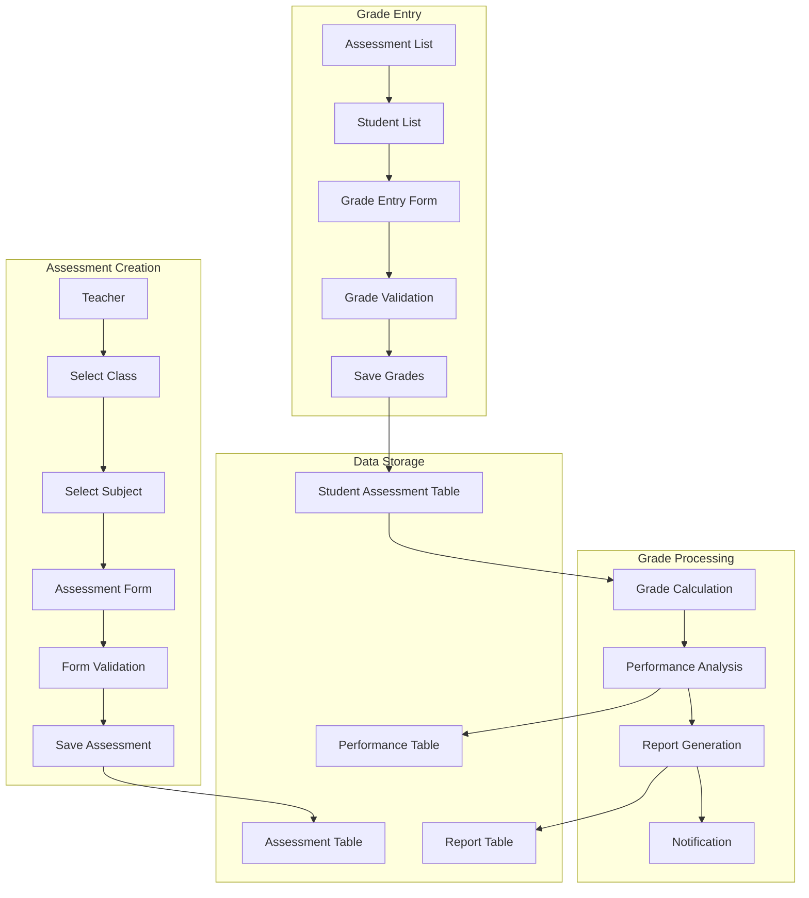
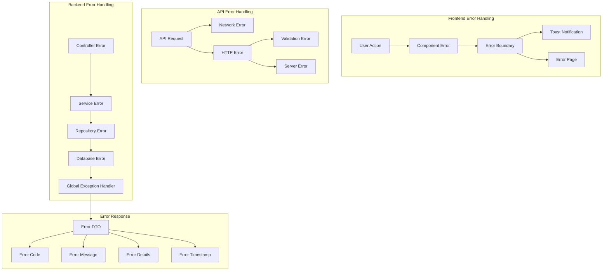
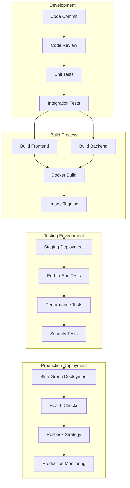

# Detailed Component Diagrams for Edu-Track System

## 1. Backend Service Layer Architecture

```mermaid
graph TB
    subgraph "Controller Layer"
        SchoolController[School Controller]
        StudentController[Student Controller]
        ClassController[Class Controller]
        AssessmentController[Assessment Controller]
        UserController[User Controller]
        GuardianController[Guardian Controller]
        GradeController[Grade Controller]
        SubjectController[Subject Controller]
        TermController[Term Controller]
        AcademicYearController[Academic Year Controller]
    end
    
    subgraph "Service Layer"
        SchoolService[School Service]
        StudentService[Student Service]
        ClassService[Class Service]
        AssessmentService[Assessment Service]
        UserService[User Service]
        GuardianService[Guardian Service]
        GradeService[Grade Service]
        SubjectService[Subject Service]
        TermService[Term Service]
        AcademicYearService[Academic Year Service]
    end
    
    subgraph "Repository Layer"
        SchoolRepo[School Repository]
        StudentRepo[Student Repository]
        ClassRepo[Class Repository]
        AssessmentRepo[Assessment Repository]
        UserRepo[User Repository]
        GuardianRepo[Guardian Repository]
        GradeRepo[Grade Repository]
        SubjectRepo[Subject Repository]
        TermRepo[Term Repository]
        AcademicYearRepo[Academic Year Repository]
    end
    
    subgraph "Cross-Cutting Concerns"
        Validation[Bean Validation]
        ExceptionHandler[Global Exception Handler]
        TenantInterceptor[Tenant Interceptor]
        Security[JWT Security]
        Logging[Logging]
    end
    
    SchoolController --> SchoolService
    StudentController --> StudentService
    ClassController --> ClassService
    AssessmentController --> AssessmentService
    UserController --> UserService
    GuardianController --> GuardianService
    GradeController --> GradeService
    SubjectController --> SubjectService
    TermController --> TermService
    AcademicYearController --> AcademicYearService
    
    SchoolService --> SchoolRepo
    StudentService --> StudentRepo
    ClassService --> ClassRepo
    AssessmentService --> AssessmentRepo
    UserService --> UserRepo
    GuardianService --> GuardianRepo
    GradeService --> GradeRepo
    SubjectService --> SubjectRepo
    TermService --> TermRepo
    AcademicYearService --> AcademicYearRepo
    
    SchoolController --> Validation
    StudentController --> Validation
    ClassController --> Validation
    AssessmentController --> Validation
    UserController --> Validation
    GuardianController --> Validation
    GradeController --> Validation
    SubjectController --> Validation
    TermController --> Validation
    AcademicYearController --> Validation
    
    Validation --> ExceptionHandler
    ExceptionHandler --> TenantInterceptor
    TenantInterceptor --> Security
    Security --> Logging
```

## 2. Frontend Component Architecture

```mermaid
graph TB
    subgraph "Page Components"
        DashboardPage[Dashboard Page]
        SchoolProfilePage[School Profile Page]
        StudentManagementPage[Student Management Page]
        ClassManagementPage[Class Management Page]
        AssessmentPage[Assessment Page]
        ReportsPage[Reports Page]
        SettingsPage[Settings Page]
    end
    
    subgraph "Feature Components"
        StudentList[Student List Component]
        StudentDetails[Student Details Component]
        ClassList[Class List Component]
        ClassDetails[Class Details Component]
        AssessmentList[Assessment List Component]
        AssessmentForm[Assessment Form Component]
        GradeBook[Grade Book Component]
        PerformanceChart[Performance Chart Component]
    end
    
    subgraph "UI Components"
        Button[Button Component]
        Input[Input Component]
        Dialog[Dialog Component]
        Table[Table Component]
        Card[Card Component]
        Form[Form Component]
        Chart[Chart Component]
        Avatar[Avatar Component]
        Badge[Badge Component]
    end
    
    subgraph "Layout Components"
        Sidebar[Sidebar Component]
        Header[Header Component]
        Navigation[Navigation Component]
        Breadcrumb[Breadcrumb Component]
        Footer[Footer Component]
    end
    
    subgraph "State Management"
        ReactQuery[TanStack Query]
        LocalStorage[Local Storage]
        Context[React Context]
        Router[TanStack Router]
    end
    
    DashboardPage --> StudentList
    DashboardPage --> ClassList
    DashboardPage --> PerformanceChart
    
    StudentManagementPage --> StudentList
    StudentManagementPage --> StudentDetails
    
    ClassManagementPage --> ClassList
    ClassManagementPage --> ClassDetails
    
    AssessmentPage --> AssessmentList
    AssessmentPage --> AssessmentForm
    AssessmentPage --> GradeBook
    
    StudentList --> Table
    StudentDetails --> Card
    ClassList --> Table
    ClassDetails --> Card
    AssessmentList --> Table
    AssessmentForm --> Form
    GradeBook --> Table
    PerformanceChart --> Chart
    
    Table --> Button
    Table --> Input
    Card --> Avatar
    Card --> Badge
    Form --> Input
    Form --> Button
    Form --> Dialog
    
    DashboardPage --> Sidebar
    StudentManagementPage --> Sidebar
    ClassManagementPage --> Sidebar
    AssessmentPage --> Sidebar
    
    Sidebar --> Navigation
    Sidebar --> Header
    
    StudentList --> ReactQuery
    ClassList --> ReactQuery
    AssessmentList --> ReactQuery
    PerformanceChart --> ReactQuery
    
    ReactQuery --> LocalStorage
    ReactQuery --> Context
    Context --> Router
```

## 3. Data Flow for Student Management

## 4. Authentication & Authorization Flow

## 5. Multi-Tenancy Implementation Details

## 6. Assessment Management Flow

## 7. Error Handling Architecture

## 8. Performance Optimization Strategy

```mermaid
graph TB
    subgraph "Frontend Optimization"
        CodeSplitting[Code Splitting]
        LazyLoading[Lazy Loading]
        Memoization[Memoization]
        VirtualScrolling[Virtual Scrolling]
        ImageOptimization[Image Optimization]
    end
    
    subgraph "API Optimization"
        Pagination[Pagination]
        Filtering[Filtering]
        Sorting[Sorting]
        Caching[API Caching]
        Compression[Response Compression]
    end
    
    subgraph "Database Optimization"
        Indexing[Database Indexing]
        QueryOptimization[Query Optimization]
        ConnectionPooling[Connection Pooling]
        ReadReplicas[Read Replicas]
        QueryCaching[Query Caching]
    end
    
    subgraph "Infrastructure Optimization"
        CDN[CDN for Static Assets]
        LoadBalancing[Load Balancing]
        AutoScaling[Auto Scaling]
        Monitoring[Performance Monitoring]
        Alerting[Performance Alerting]
    end
    
    CodeSplitting --> LazyLoading
    LazyLoading --> Memoization
    Memoization --> VirtualScrolling
    VirtualScrolling --> ImageOptimization
    
    Pagination --> Filtering
    Filtering --> Sorting
    Sorting --> Caching
    Caching --> Compression
    
    Indexing --> QueryOptimization
    QueryOptimization --> ConnectionPooling
    ConnectionPooling --> ReadReplicas
    ReadReplicas --> QueryCaching
    
    CDN --> LoadBalancing
    LoadBalancing --> AutoScaling
    AutoScaling --> Monitoring
    Monitoring --> Alerting
```

## 9. Security Implementation Details

```mermaid
graph TB
    subgraph "Authentication Security"
        PasswordHashing[Password Hashing]
        JWTToken[JWT Token Generation]
        TokenValidation[Token Validation]
        SessionManagement[Session Management]
        PasswordPolicy[Password Policy]
    end
    
    subgraph "Authorization Security"
        RoleBasedAccess[Role-Based Access Control]
        ResourceAccess[Resource Access Control]
        TenantIsolation[Tenant Isolation]
        PermissionMatrix[Permission Matrix]
        AccessAudit[Access Audit Log]
    end
    
    subgraph "Data Security"
        InputSanitization[Input Sanitization]
        SQLInjectionPrevention[SQL Injection Prevention]
        XSSPrevention[XSS Prevention]
        CSRFProtection[CSRF Protection]
        DataEncryption[Data Encryption]
    end
    
    subgraph "Infrastructure Security"
        HTTPSEnforcement[HTTPS Enforcement]
        SecurityHeaders[Security Headers]
        RateLimiting[Rate Limiting]
        FirewallRules[Firewall Rules]
        SecurityMonitoring[Security Monitoring]
    end
    
    PasswordHashing --> JWTToken
    JWTToken --> TokenValidation
    TokenValidation --> SessionManagement
    SessionManagement --> PasswordPolicy
    
    RoleBasedAccess --> ResourceAccess
    ResourceAccess --> TenantIsolation
    TenantIsolation --> PermissionMatrix
    PermissionMatrix --> AccessAudit
    
    InputSanitization --> SQLInjectionPrevention
    SQLInjectionPrevention --> XSSPrevention
    XSSPrevention --> CSRFProtection
    CSRFProtection --> DataEncryption
    
    HTTPSEnforcement --> SecurityHeaders
    SecurityHeaders --> RateLimiting
    RateLimiting --> FirewallRules
    FirewallRules --> SecurityMonitoring
```

## 10. Deployment Pipeline

These detailed component diagrams provide a comprehensive view of the system's internal architecture, data flows, and implementation strategies for the Edu-Track educational management system. 