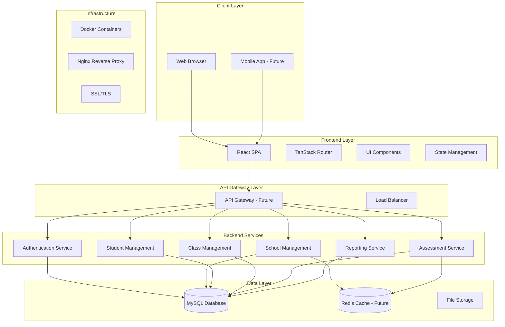
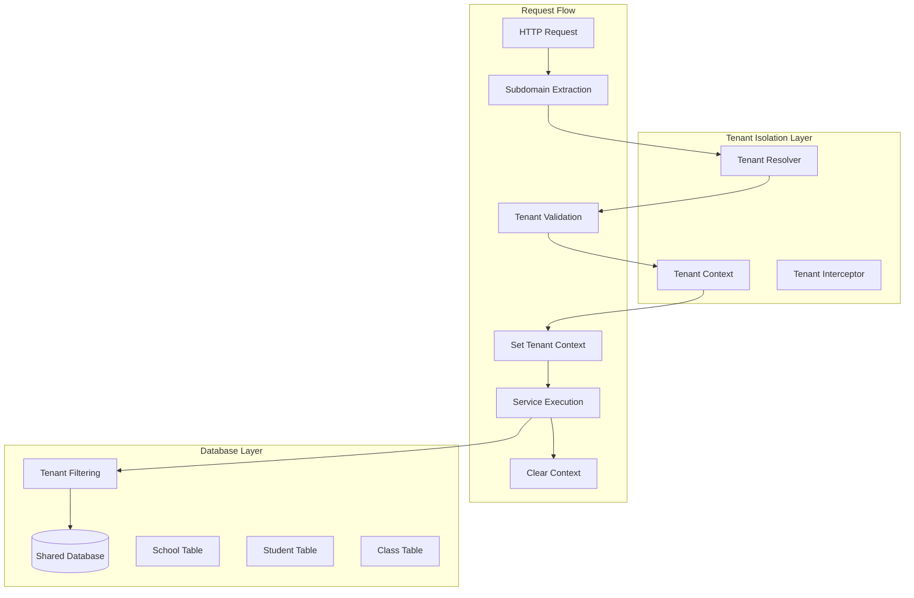
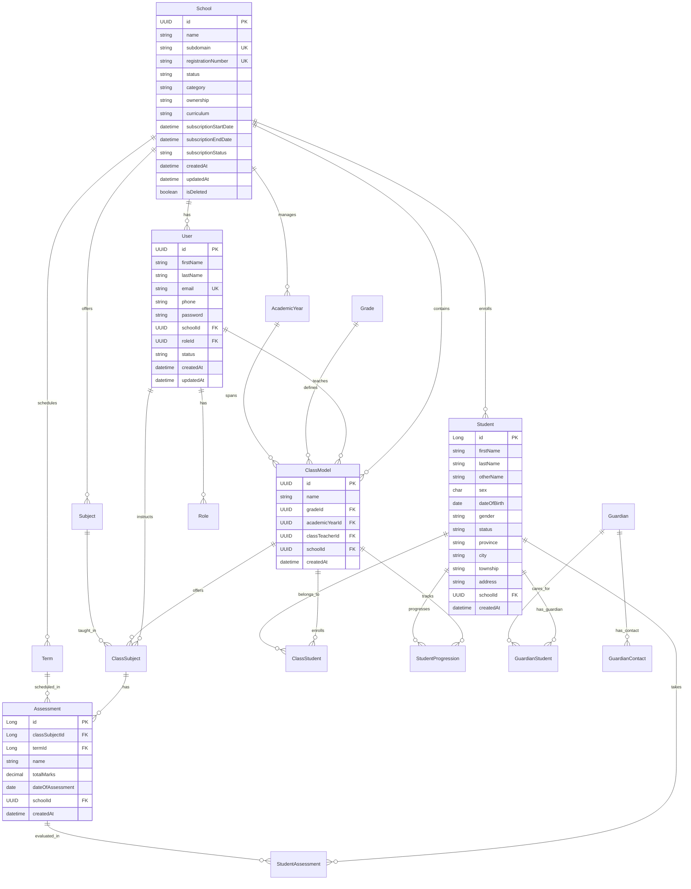
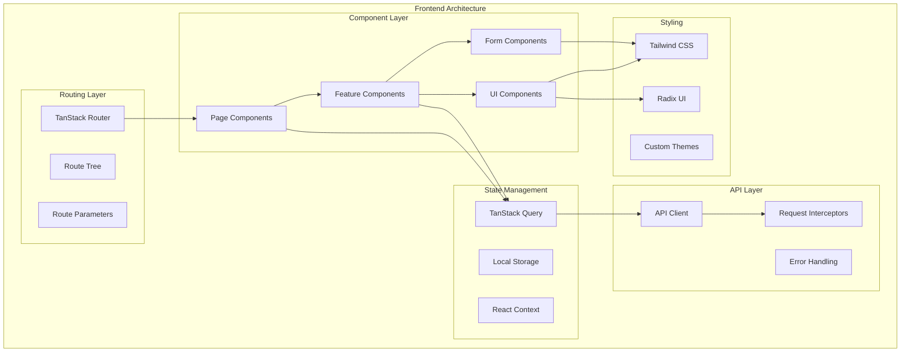
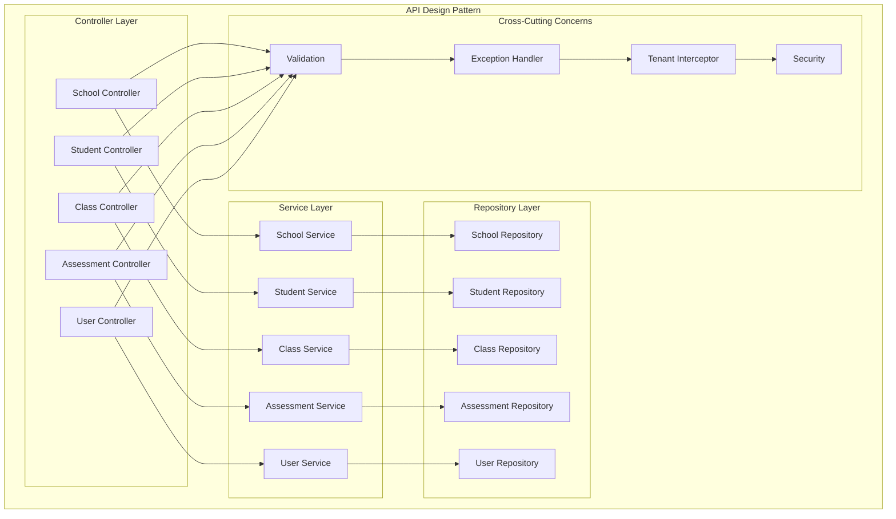
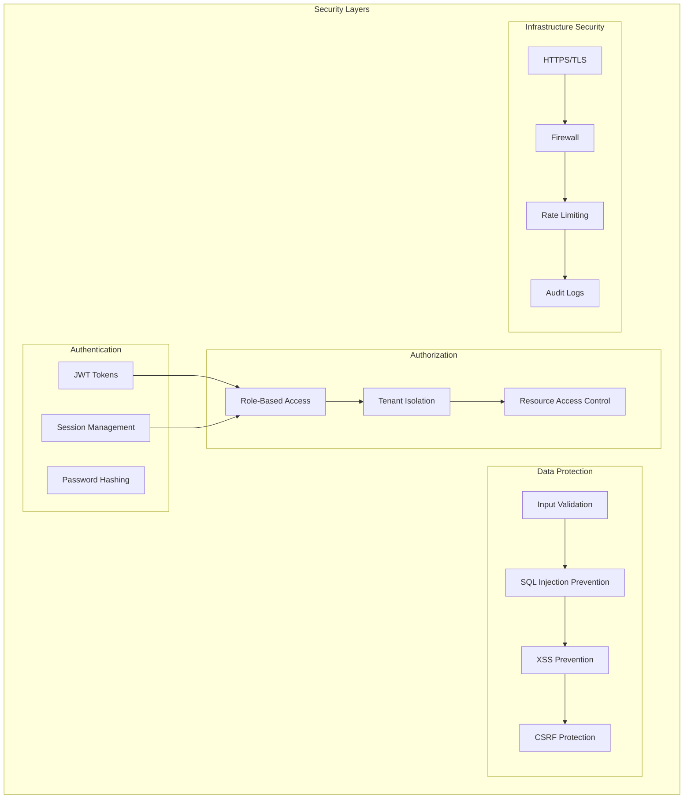
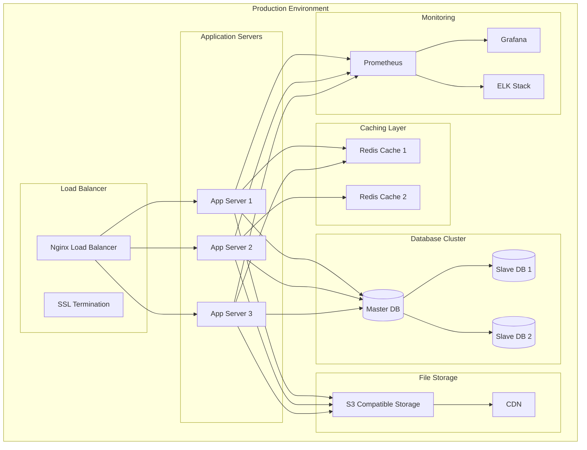
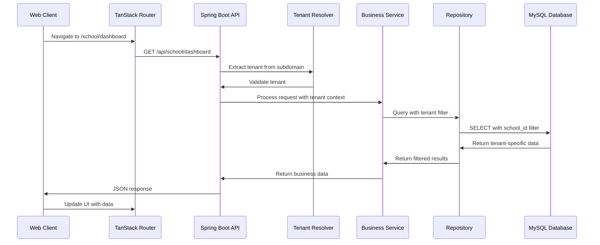

# Edu-Track System Architecture & Design Specification

## 1. System Overview

Edu-Track is a multi-tenant educational management system consisting of:
- **Backend**: Spring Boot REST API with multi-tenancy support
- **Frontend**: React-based SPA with TanStack Router
- **Database**: MySQL with tenant isolation
- **Architecture**: Microservices-ready with clear separation of concerns

## 2. High-Level System Architecture

## 3. Multi-Tenancy Architecture

## 4. Database Schema Architecture

## 5. Frontend Architecture

## 6. API Design Architecture

## 7. Security Architecture

## 8. Deployment Architecture

## 9. Data Flow Architecture

## 10. Technology Stack

### Backend Stack
- **Framework**: Spring Boot 3.4.5
- **Language**: Java 17
- **Database**: MySQL 8.0
- **ORM**: Hibernate/JPA
- **Build Tool**: Maven
- **Security**: JWT Authentication
- **Validation**: Bean Validation
- **Documentation**: OpenAPI/Swagger (planned)

### Frontend Stack
- **Framework**: React 18.3.1
- **Language**: TypeScript 5.5.3
- **Router**: TanStack Router 1.58.15
- **State Management**: TanStack Query 5.56.2
- **UI Library**: Radix UI
- **Styling**: Tailwind CSS 3.4.13
- **Build Tool**: Vite 5.4.1
- **Package Manager**: Bun

### Infrastructure Stack
- **Containerization**: Docker (planned)
- **Reverse Proxy**: Nginx (planned)
- **Caching**: Redis (planned)
- **Monitoring**: Prometheus + Grafana (planned)
- **Logging**: ELK Stack (planned)

## 11. Key Design Patterns

1. **Multi-Tenancy Pattern**: Subdomain-based tenant isolation
2. **Repository Pattern**: Data access abstraction
3. **Service Layer Pattern**: Business logic separation
4. **Interceptor Pattern**: Cross-cutting concerns
5. **Factory Pattern**: Object creation
6. **Observer Pattern**: Event handling
7. **Strategy Pattern**: Algorithm selection
8. **Builder Pattern**: Complex object construction

## 12. Performance Considerations

1. **Database Optimization**: Indexed queries, connection pooling
2. **Caching Strategy**: Redis for frequently accessed data
3. **API Optimization**: Pagination, filtering, sorting
4. **Frontend Optimization**: Code splitting, lazy loading
5. **CDN Integration**: Static asset delivery
6. **Load Balancing**: Horizontal scaling capability

## 13. Scalability Strategy

1. **Horizontal Scaling**: Multiple application instances
2. **Database Scaling**: Read replicas, sharding
3. **Caching Layers**: Multi-level caching
4. **Microservices**: Service decomposition
5. **Event-Driven**: Asynchronous processing
6. **Container Orchestration**: Kubernetes deployment

## 14. Monitoring & Observability

1. **Application Metrics**: Response times, error rates
2. **Business Metrics**: User activity, feature usage
3. **Infrastructure Metrics**: CPU, memory, disk usage
4. **Logging**: Structured logging with correlation IDs
5. **Tracing**: Distributed tracing for request flows
6. **Alerting**: Proactive issue detection

This architecture provides a solid foundation for a scalable, maintainable, and secure educational management system with clear separation of concerns and modern development practices. 